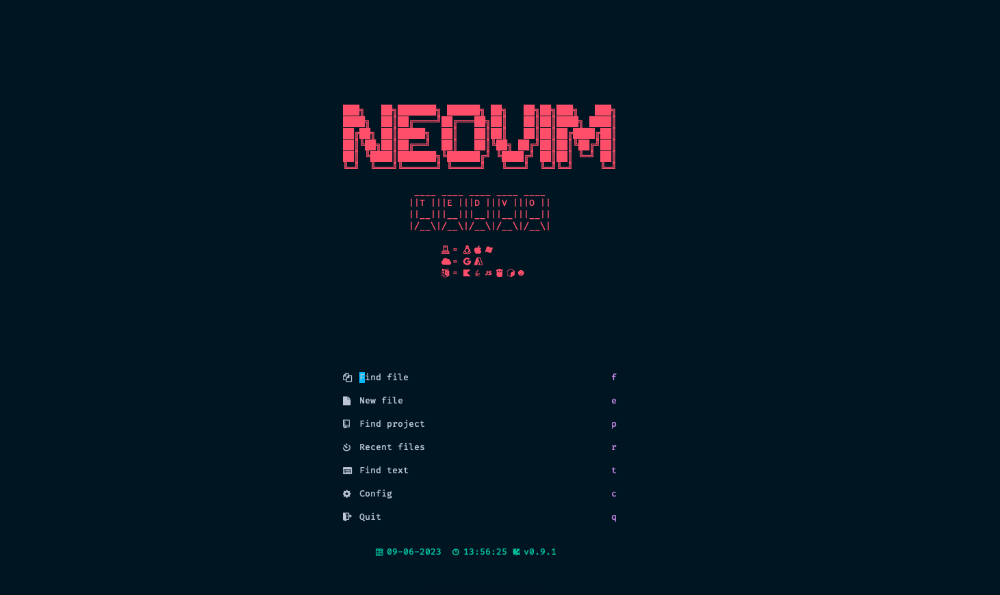

# A Basic Stable IDE config for Neovim

## Demo



## Install Neovim 0.9

You can install Neovim with your package manager e.g. brew, apt, pacman etc.. but remember that when you update your packages Neovim may be upgraded to a newer version.

If you would like to make sure Neovim only updates when you want it to than I recommend installing from source:

```sh
git clone https://github.com/neovim/neovim.git
cd neovim
git checkout release-0.9
make CMAKE_BUILD_TYPE=Release
sudo make install
```

## Install The Configuration

Make sure to remove or move your current `nvim` directory

```sh
git clone https://github.com/ted-vo/nvim.git ~/.config/nvim
```

Run `nvim` and wait for the plugins to be installed

**NOTE** (You will notice treesitter pulling in a bunch of parsers the next time you open Neovim)

**NOTE** Checkout this file for some predefined keymaps: [keymaps](https://github.com/ted-vo/nvim/blob/master/lua/keymaps.lua)

## Get healthy

Open `nvim` and enter the following:

```
:checkhealth
```

You'll probably notice you don't have support for copy/paste also that python and node haven't been setup

So let's fix that

First we'll fix copy/paste

- On mac `pbcopy` should be builtin

- On Ubuntu

  ```sh
  sudo apt install xsel # for X11
  sudo apt install wl-clipboard # for wayland
  ```

Next we need to install python support (node is optional)

- Neovim python support

  ```sh
  pip install pynvim
  ```

- Neovim node support

  ```sh
  npm i -g neovim
  ```

We will also need `ripgrep` for Telescope to work:

- Ripgrep

  ```sh
  sudo apt install ripgrep
  ```

---

**NOTE** make sure you have [node](https://nodejs.org/en/) installed, I recommend a node manager like [fnm](https://github.com/Schniz/fnm).

## Fonts

I recommend using the following repo to get a "Nerd Font" (Font that supports icons)

[getnf](https://github.com/ronniedroid/getnf)

## Configuration

### LSP

To add a new LSP

First Enter:

```
:Mason
```

and press `i` on the Language Server you wish to install

Next you will need to add the server to this list: [servers](https://github.com/ted-vo/nvim/tree/master/lua/lsp/init.lua#L3)

1. You can add the lsp name in [mason lsp block](https://github.com/ted-vo/nvim/tree/master/lua/lsp/init.lua#L3-L13)

```lua
-- lua/utils/init.lua
M.servers = {
	"lua_ls",
	"cssls",
	"html",
	"tsserver",
	"pyright",
	"bashls",
	"jsonls",
	"yamlls",
   	"terraform_lsp" -- New LSP
}
```

2. Manually install the binary of the lsp and put it in your path by downloading the binary or through your package manager. For terraform_lsp [example](https://github.com/juliosueiras/terraform-lsp/releases)

### Formatters and linters

Make sure the formatter or linter is installed and add it to this setup function: [null-ls](https://github.com/ted-vo/nvim/tree/master/lua/user/lsp/null-ls.lua#L13)

**NOTE** Some are already setup as examples, remove them if you want

### Plugins

You can install new plugins here: [plugins](https://github.com/ted-vo/nvim/tree/master/lua/user/plugins.lua#L42)

---

## Plugins

- [alpha-nvim](https://github.com/goolord/alpha-nvim)
- [bufdelete](https://github.com/famiu/bufdelete.nvim)
- [bufferline.nvim](https://github.com/akinsho/bufferline.nvim)
- [cmp-buffer](https://github.com/hrsh7th/cmp-buffer)
- [cmp-nvim-lsp](https://github.com/hrsh7th/cmp-nvim-lsp)
- [cmp-nvim-lua](https://github.com/hrsh7th/cmp-nvim-lua)
- [cmp-path](https://github.com/hrsh7th/cmp-path)
- [cmp_luasnip](https://github.com/saadparwaiz1/cmp_luasnip)
- [Comment.nvim](https://github.com/numToStr/Comment.nvim)
- [DAPInstall.nvim](https://github.com/ravenxrz/DAPInstall.nvim)
- [gitsigns.nvim](https://github.com/lewis6991/gitsigns.nvim)
- [indent-blankline.nvim](https://github.com/lukas-reineke/indent-blankline.nvim)
- [lazy.nvim](https://github.com/folke/lazy.nvim)
- [vim-illuminate](https://github.com/RRethy/vim-illuminate)
- [impatient.nvim](https://github.com/lewis6991/impatient.nvim)
- [LuaSnip](https://github.com/L3MON4D3/LuaSnip)
- [mason-lspconfig.nvim](https://github.com/williamboman/mason-lspconfig.nvim)
- [mason](https://github.com/williamboman/mason.nvim)
- [null-ls.nvim](https://github.com/jose-elias-alvarez/null-ls.nvim)
- [nvim-autopairs](https://github.com/windwp/nvim-autopairs)
- [nvim-cmp](https://github.com/hrsh7th/nvim-cmp)
- [nvim-dap-ui](https://github.com/rcarriga/nvim-dap-ui)
- [nvim-dap](https://github.com/mfussenegger/nvim-dap)
- [nvim-lspconfig](https://github.com/neovim/nvim-lspconfig)
- [nvim-tree.lua](https://github.com/kyazdani42/nvim-tree.lua)
- [nvim-treesitter](https://github.com/nvim-treesitter/nvim-treesitter)
- [nvim-ts-context-commentstring](https://github.com/JoosepAlviste/nvim-ts-context-commentstring)
- [nvim-web-devicons](https://github.com/kyazdani42/nvim-web-devicons)
- [project.nvim](https://github.com/ahmedkhalf/project.nvim)
- [telescope.nvim](https://github.com/nvim-telescope/telescope.nvim)
- [toggleterm.nvim](https://github.com/akinsho/toggleterm.nvim)
- [tokyonight.nvim](https://github.com/folke/tokyonight.nvim)
- [plenary](https://github.com/nvim-lua/plenary.nvim)
- [vim-bbye](https://github.com/moll/vim-bbye)
- [lualine.nvim](https://github.com/nvim-lualine/lualine.nvim)
- [darkplus.nvim](https://github.com/LunarVim/darkplus.nvim)
- [friendly-snippets](https://github.com/rafamadriz/friendly-snippets)
- [nvim-lsp-installer](https://github.com/williamboman/nvim-lsp-installer)

---

> The computing scientist's main challenge is not to get confused by the complexities of his own making.

\- Edsger W. Dijkstra
